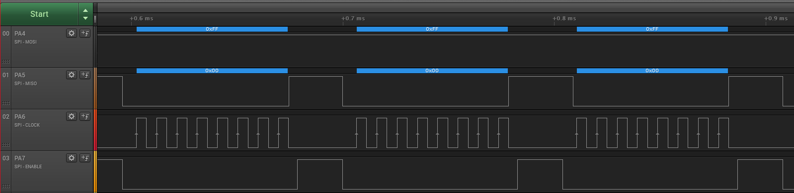

 # Receiving Data as Client

This example demonstrates how to configure the device in SPI Client mode to wait for incoming data. When data is received, another data is sent to the host device. Data are received and read using the SPI interrupt.

## Related Documentation

More details and code examples on the AVR128DA48 can be found at the following links:
- [TB3215 - Getting Started with Serial Peripheral Interface (SPI)](https://ww1.microchip.com/downloads/en/Appnotes/TB3215-Getting-Started-with-SPI-DS90003215.pdf)
- [AVR128DA48 Product Page](https://www.microchip.com/wwwproducts/en/AVR128DA48)
- [AVR128DA48 Code Examples on GitHub](https://github.com/microchip-pic-avr-examples?q=avr128da48)
- [AVR128DA48 Project Examples in START](https://start.atmel.com/#examples/AVR128DA48CuriosityNano)

## Software Used

- MPLAB® X IDE 5.40 or newer [(microchip.com/mplab/mplab-x-ide)](http://www.microchip.com/mplab/mplab-x-ide)
- MPLAB® XC8 2.30 or a newer compiler [(microchip.com/mplab/compilers)](http://www.microchip.com/mplab/compilers)
- MPLAB® Code Configurator (MCC) 4.0.1 or newer [(microchip.com/mplab/mplab-code-configurator)](https://www.microchip.com/mplab/mplab-code-configurator)
- MPLAB® Code Configurator (MCC) Device Libraries 8-bit AVR MCUs 2.5.0 or newer [(microchip.com/mplab/mplab-code-configurator)](https://www.microchip.com/mplab/mplab-code-configurator)
- AVR-Dx 1.4.75 or newer Device Pack

## Hardware Used

- AVR128DA48 Curiosity Nano [(DM164151)](https://www.microchip.com/Developmenttools/ProductDetails/DM164151)

## Setup
The AVR128DA48 Curiosity Nano Development Board is used as a test platform.

 

The following configurations must be made for this project:

- System clock is configured at 3.33 MHz
- Global interrupts enabled
- SPI0
  - configured in Client mode
  - Data mode 0
  - LSB transmitted first
  - SPI interrupt enabled
  - SCK - PA6, SS - PA7, MOSI - PA4, MISO - PA5

|Pin                       | Configuration      |
| :---------------------:  | :----------------: |
|         PA4 (MOSI) 	     |   Digital output   |
|         PA5 (MISO) 	     |   Digital input    |
|         PA6 (SCK) 	     |   Digital output   |
|         PA7 (SS) 	       |   Digital output   |

## Operation

1.  Connect the board to the PC.

2.  Open the Receiving_Data_as_Client.X project in MPLAB® X IDE.

3.  Set the Receiving_Data_as_Client.X project as the main project. Right click the project in the **Projects** tab and click **Set as Main Project**.

 

4.  Clean and build the Receiving_Data_as_Client.X project. Right click the **Receiving_Data_as_Client.X** project and select **Clean and Build**.

 

5.  Select **AVR128DA48 Curiosity Nano** in the Connected Hardware Tool section of the project settings:

- Right click the project and click **Properties**;
- Click the arrow under the Connected Hardware Tool;
- Select **AVR128DA48 Curiosity Nano** (click on the **SN**), click **Apply** and then click **OK**:

 

6.  Program the project to the board. Right click the project and then click **Make and Program Device**.

 

## Demo

The image below shows the MOSI (PA4), MISO (PA5), SCK (PA6) and SS (PA7) signals captured by a logic analyzer. The client device receives `0xFF` through MOSI line and sends `0x00` through MISO line.
 

## Summary

This example showed how to configure the device in SPI Client mode, and receive data using the SPI interrupt.
